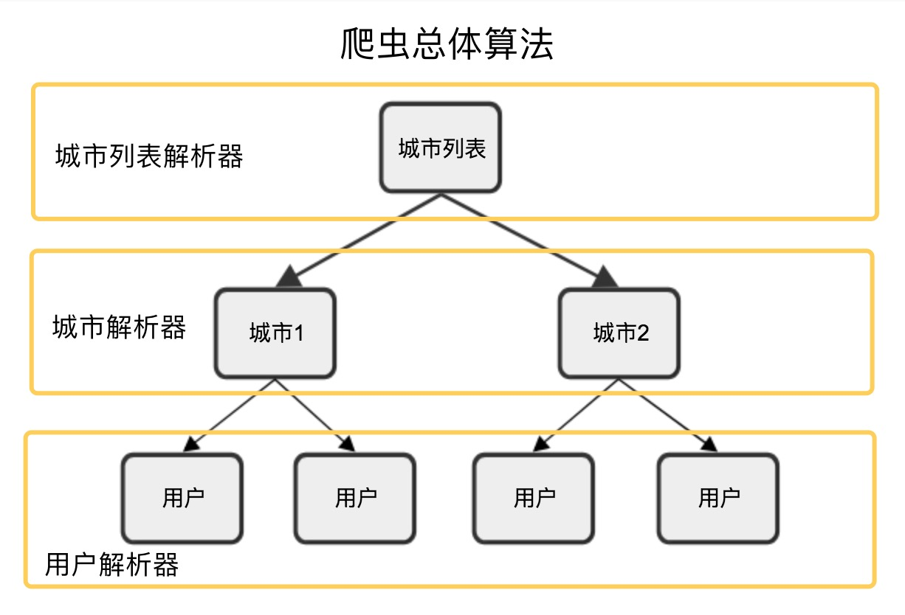
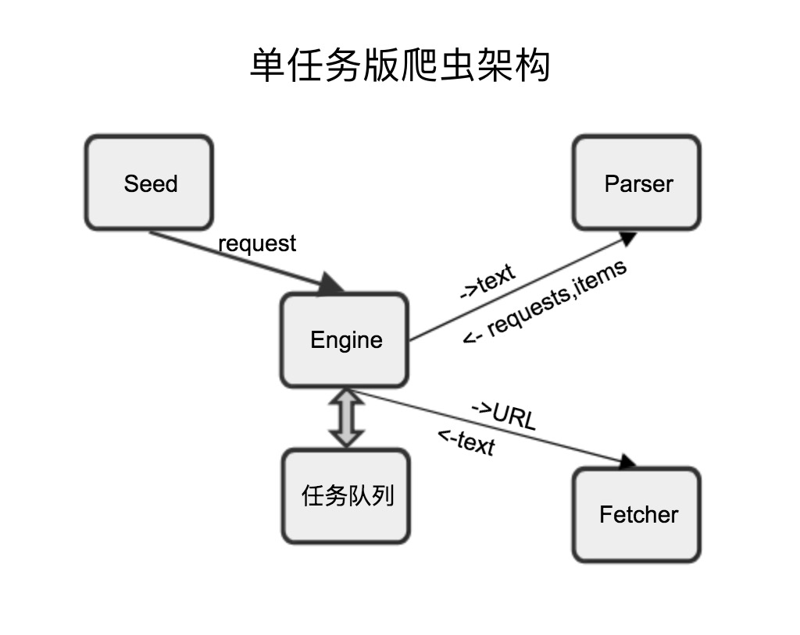
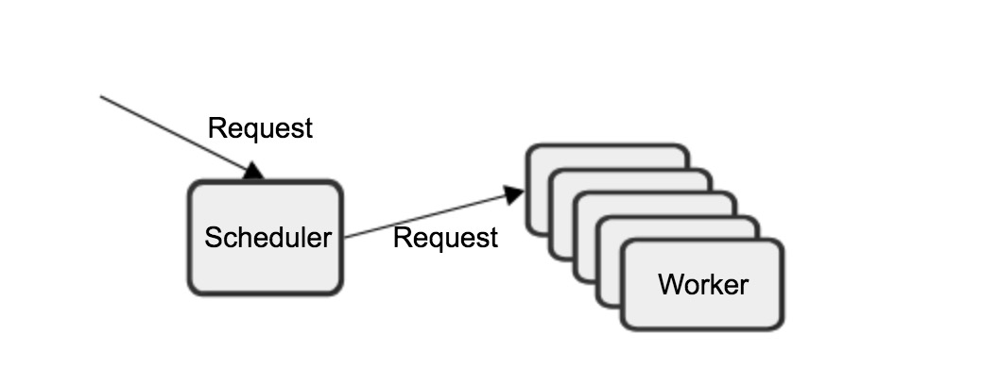
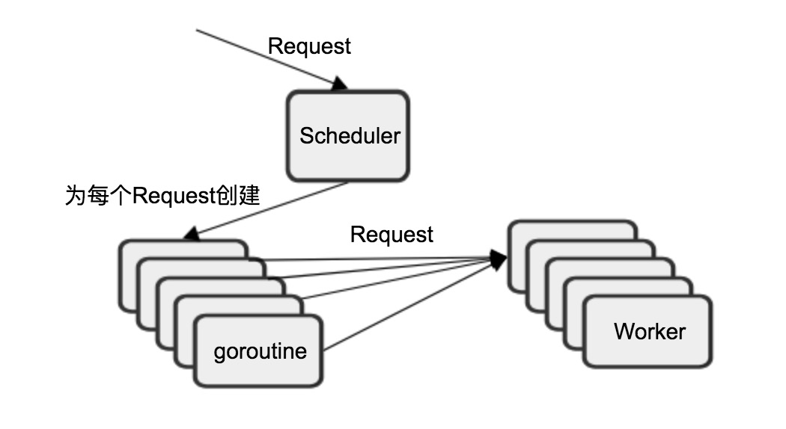
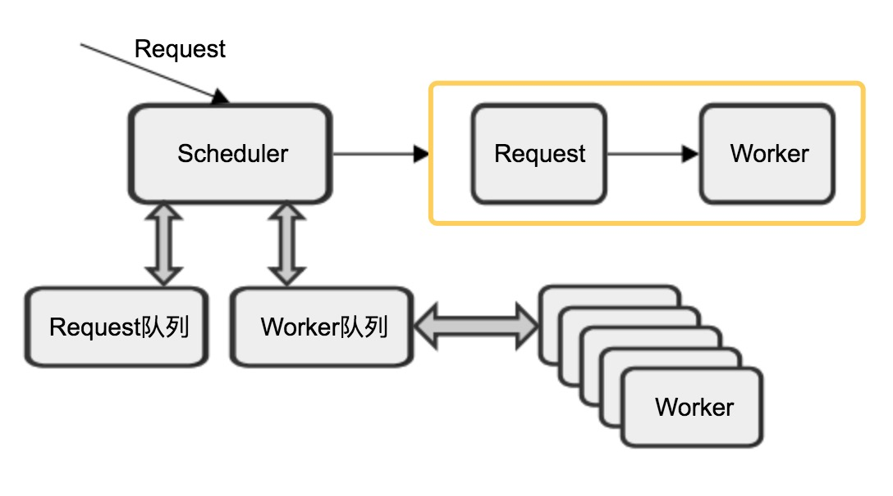
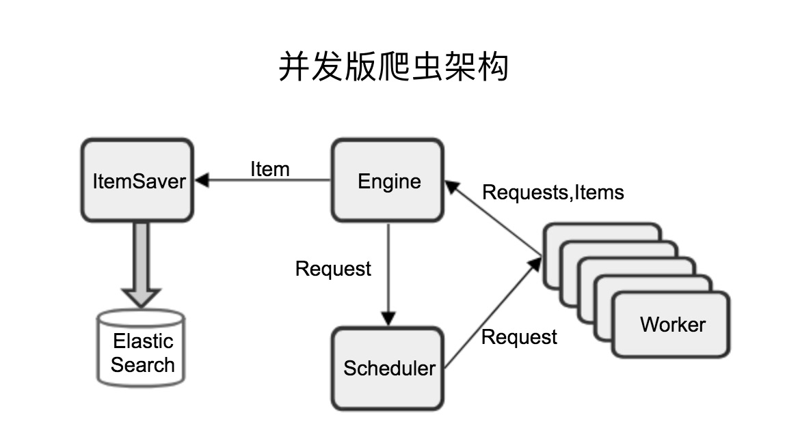

# spider

#### 爬虫的总体算法




#### 单任务版爬虫结构
解析器Paeser
输入Utf-8编码文本
输出Request{URL,对应Parser}列表,Item列表



#### 并发架构的演变
* Scheduler实现1:所有worker公用一个输入

* Scheduler实现2:并发分发request

* Scheduler实现3:request队列和worker队列


* 并发版爬虫架构



#### 并发版爬虫目前存在的问题:
- 限流问题
	- 单节点 能够承受的流量有限
	- 解决问题: 将worker放到不同的节点
- 去重问题
	- 单节点能承受的去重数据有限
	- 无法保存之前去重结果
	- 解决问题:基于key-value-store(如:redis) 进行分布式去重
- 数据存储问题
	- 存储部分的结构,技术栈和爬虫部分区别很大
	- 进一步优化需要特殊的ElasticSearch技术背景
	- 固有分布式
	
#### 使用说明
* 安装依赖

```
go get github.com/urfave/cli

go get golang.org/x/text
go get golang.org/x/net

go get gopkg.in/olivere/elastic.v5

```
